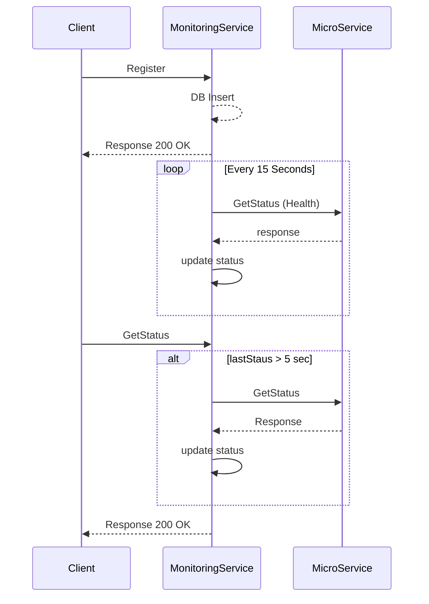

# Monitoring Service!
Service monitores all the registered microservice. It probs the registered microservices at each 15 seconds and save the status of each microservice into the **inMemory** Database. If client request for status within 5 second of scheduled probe, **Monitoring** **service** returns the saved status otherwise it probe the requested microservice url to get the current status.

## Rest Endpoints
#### Registration
	Endpoint : localhost:8080/monitoring/microservice/register
	Request Method : POST
	Content Type : application/json
	Request body =: 	{
					"serviceName": "service1",
					"serviceUrl": "http://localhost:9090/health"
					}
	Response: 200 OK

#### Delete Microservice
	Endpoint: http://localhost:8080/monitoring/microservice/deregister/{serviceName}
	Request Method : GET
	Content Type : application/json
	
	Response: 200 OK (SUCCESS), Fail ( 404 Not Found)
	

#### Get Status of all registered Microservices
		
	Endpoint : http://localhost:8080/monitoring/microservices
	Request Method : GET
	Content Type : application/json

	Response: 200 OK
	Rsponse Body:
	[
	    {
	        "serviceName": "MicroService1",
	        "serviceUrl": "http://localhost:9090/health",
	        "active": true
	    },
	    {
	        "serviceName": "MicroService2",
	        "serviceUrl": "http://localhost:9090/health",
	        "active": true
	    }
	]
		
#### Get Status Specific registered Microservices
		
	Endpoint : htpp://localhost:8080/monitoring/microservice/{serviceName}
	Request Method : GET
	Content Type : application/json

	Response: 200 OK
	Rsponse Body:
	{
	        "serviceName": "MicroService1",
	        "serviceUrl": "http://localhost:9090/health",
	        "active": true
	}
		
#### Get Status Microservice total downtime
		
	Endpoint : http://localhost:8080/monitoring/microservice/downtime/{serviceName}
	Request Method : GET
	Content Type : application/json

	Response: 200 OK
	Rsponse Body:
	{
	    "serviceName": "MicroService1",
	    "currentState": "Down",
	    "timUnit": "SECOND",
	    "totalDowntime": 124
	}

## Deployement:
### Build :
	$>mvn clean build
### Run
-Go to target folder.		
					
	$> java -jar monitoringservice-0.0.1-SNAPSHOT.jar  	

## Proxy Configuration:
To configure the proxy, set the following properties in `application.properties`
			
	proxyEnabled=false
	http.proxy.override-default=false
	http.proxy.proxy-host=fsdf
	http.proxy.proxy-port=-1
	http.proxy.user-name=user
	http.proxy.password=password
	http.proxy.no-proxy-hosts=localhost

## UML diagrams

